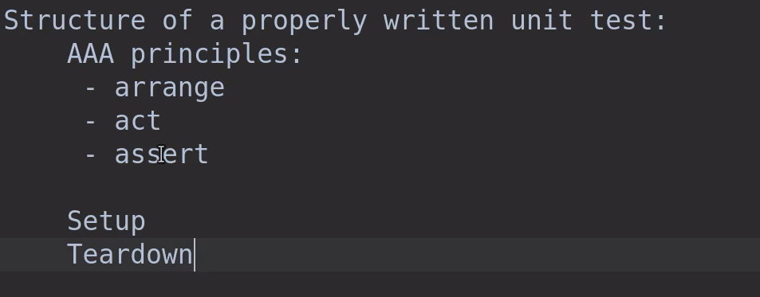
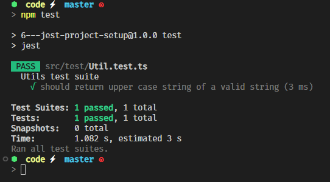

- [2 - Basics of testing with Jest](#2---basics-of-testing-with-jest)
	- [4 - Section intro](#4---section-intro)
	- [5 - Jest introduction](#5---jest-introduction)
	- [6 - Jest project setup](#6---jest-project-setup)
	- [7 - Structure of an unit test](#7---structure-of-an-unit-test)
	- [8 - Jest assertions and matchers](#8---jest-assertions-and-matchers)
	- [9 - Multiple tests structure](#9---multiple-tests-structure)
	- [10 - Parametrized tests](#10---parametrized-tests)
- [3 - Intermediate testing topics](#3---intermediate-testing-topics)
	- [11 - Section intro](#11---section-intro)
	- [12 - FIRST principles](#12---first-principles)
	- [13 - Jest hooks](#13---jest-hooks)
	- [14 - Testing for errors](#14---testing-for-errors)
	- [15 - Jest aliases and watch mode](#15---jest-aliases-and-watch-mode)
	- [16 - VSCode debug configuration](#16---vscode-debug-configuration)
	- [17 - Coverage](#17---coverage)

## 2 - Basics of testing with Jest

### 4 - Section intro

### 5 - Jest introduction


 
### 6 - Jest project setup

initiailize a project
```bash
npm init -y
```
it will create a package.json file

```json
{
  "name": "6---jest-project-setup",
  "version": "1.0.0",
  "description": "",
  "main": "index.js",
  "scripts": {
    "test": "echo \"Error: no test specified\" && exit 1"
  },
  "keywords": [],
  "author": "",
  "license": "ISC"
}

```

let's install dev dependencies
```bash
npm i -D typescript jest ts-jest @types/jest ts-node

```

let's create the jest config file
```bash
npx ts-jest config:init
```
let's create a jest config file `jest.config.ts`
```ts
import type { Config } from '@jest/types';

const Config: Config.InitialOptions = {
	preset: 'ts-jest',
	testEnvironment: 'node',
	verbose: true
};

export default Config;

```

let's make a simple folder structure


let's write a simple test
```ts
import { toUpperCase } from '../app/Util';

describe('Utils test suite', () => {
	test('should return upper case string', () => {
		const result = toUpperCase('hello');
		expect(result).toBe('HELLO');
	});
});

``` 

and add the test script to package.json

```json
  "scripts": {
    "test": "jest"
  },
```


we are getting a warning let's fix it

let's add typescript config file `tsconfig.json`
```bash
tsc --init
```

now the warning is gone


### 7 - Structure of an unit test



```ts
import { toUpperCase } from '../app/Util';

describe('Utils test suite', () => {
	it('should return upper case string of a valid string', () => {
		// arrange
		const sut = toUpperCase;
		const expected = 'HELLO';
		// act
		const actual = sut('hello');

		// assert
		expect(actual).toBe(expected);
	});
});

```

output



### 8 - Jest assertions and matchers

let's create a new function to test
```ts
export type TStringInfo = {
	loweCase: string;
	upperCase: string;
	length: number;
	character: string[];
	extraInfo?: object;
};

export function getStringInfo(s: string): TStringInfo {
	return {
		loweCase: s.toLowerCase(),
		upperCase: s.toUpperCase(),
		length: s.length,
		character: s.split('')
	};
}

```

to compare objects we can use `toEqual` matcher

to compare primitive types we can use `toBe` matcher

```ts
	it('should return string info of a valid string', () => {
		// arrange
		const sut = getStringInfo;
		const expected = {
			loweCase: 'hello',
			upperCase: 'HELLO',
			length: 5,
			character: ['h', 'e', 'l', 'l', 'o']
		};
		// act
		const actual = sut('hello');

		// assert
		expect(actual).toEqual(expected);

		expect(actual.loweCase).toBe(expected.loweCase);
		expect(actual.loweCase).toHaveLength(expected.length);
		expect(actual.loweCase).toContain<string>('h');

		// array
		expect(actual.character).toEqual(expected.character);
		expect(actual.character).toHaveLength(expected.length);
		expect(actual.character).toContain<string>('h');
		// when u don't know the order
		expect(actual.character).toEqual(
			expect.arrayContaining(['l', 'l', 'o', 'h', 'e'])
		);

		// object

		expect(actual).toMatchObject({
			loweCase: 'hello',
			upperCase: 'HELLO',
			length: 5,
			character: ['h', 'e', 'l', 'l', 'o']
		});

		expect(actual).toHaveProperty('length', 5);
		expect(actual).toHaveProperty('character', ['h', 'e', 'l', 'l', 'o']);
		expect(actual).toHaveProperty('character', expect.arrayContaining(['h']));
		expect(actual).toHaveProperty(
			'character',
			expect.not.arrayContaining(['a'])
		);
		expect(actual.extraInfo).toBeUndefined();
		expect(actual).not.toHaveProperty('extraInfo');
		expect(actual.extraInfo).not.toBeTruthy();
	});
```

output


### 9 - Multiple tests structure

the above test is a bit long let's refactor it

```ts

describe('should return string info of a valid string', () => {
		const sut = getStringInfo;

		// arrange
		const expected = {
			loweCase: 'hello',
			upperCase: 'HELLO',
			length: 5,
			character: ['h', 'e', 'l', 'l', 'o']
		};
		const actual = sut('hello');

		describe('getStringInfo() for argument "hello"', () => {
			it('should return the right lowercase string', () => {
				expect(actual.loweCase).toBe(expected.loweCase);
				expect(actual.loweCase).toHaveLength(expected.length);
				expect(actual.loweCase).toContain<string>('h');
			});

			it('should return the right uppercase string', () => {
				expect(actual.upperCase).toBe(expected.upperCase);
				expect(actual.upperCase).toHaveLength(expected.length);
				expect(actual.upperCase).toContain<string>('H');
			});

			it('should return the right length', () => {
				expect(actual.length).toBe(expected.length);
			});

			it('should return the right character array', () => {
				expect(actual.character).toEqual(expected.character);
				expect(actual.character).toHaveLength(expected.length);
				expect(actual.character).toContain<string>('h');
				// when u don't know the order
				expect(actual.character).toEqual(
					expect.arrayContaining(['h', 'e', 'l', 'l', 'o'])
				);
			});

			it('should return the right info', () => {
				expect(actual.extraInfo).toBeUndefined();
				expect(actual).not.toHaveProperty('extraInfo');
				expect(actual.extraInfo).not.toBeTruthy();
			});
		});
	});

```

output


### 10 - Parametrized tests

let's write a test for the following function

```ts

describe('toUpperCase examples', () => {
    it.only.each([
        {
            input: 'hello',
          expected: 'HELLO'
        },
      {
          input: 'hElLo',
        expected: 'HELLO'
      },
      {
          input: 'HELLO',
        expected: 'HELLO'
      }
      ])('$input should return $expected', ({ input, expected }) => {
          expect(toUpperCase(input)).toBe(expected);
    });
});
```
output


- by doing so we can test multiple cases with a single test
- reduce the number of tests
- improve readability
- improve maintainability
- improve test coverage
- and more

## 3 - Intermediate testing topics

### 11 - Section intro


### 12 - FIRST principles


### 13 - Jest hooks
let's add a new class to test

```ts
export class StringUtil {
	public toUpperCase(s:string){
		return toUpperCase(s);
	}
}
```

let's write a test for it

```ts
describe.only("StringUtil test suite", () => {
		let sut: StringUtil|null;
		beforeEach(()=>{
			console.log("beforeEach");
			sut = new StringUtil();
		});
		afterEach(()=>{
			console.log("afterEach");
			sut = null;
		});

		it("Should return correct uppercase",()=>{

			const expected = "HELLO";
			// act
			const actual = sut && sut.toUpperCase("hello");
			// assert
			expect(actual).toBe(expected);
		})
	});
```
these `hooks` are called `beforeEach` and `afterEach`
and there context is relative to the place where they are defined.

output

### 14 - Testing for errors
### 15 - Jest aliases and watch mode
### 16 - VSCode debug configuration
### 17 - Coverage